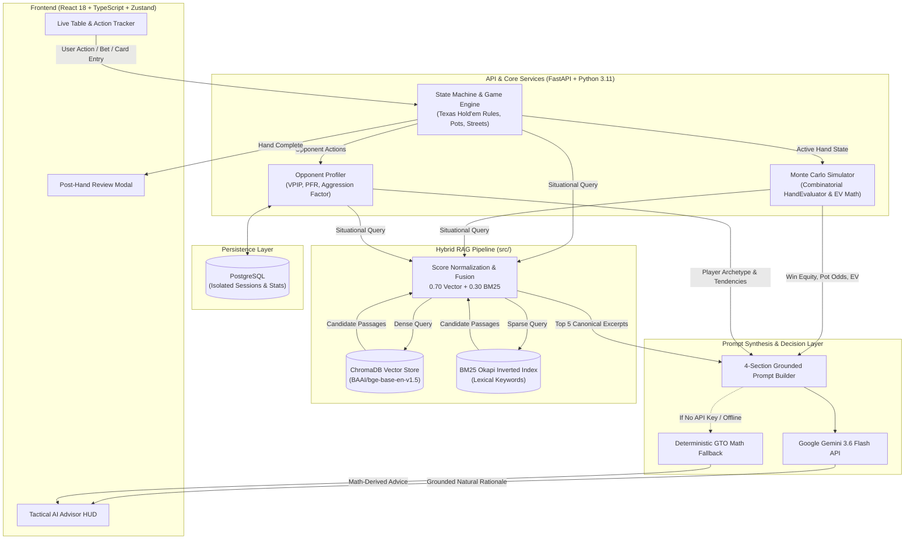

# PokerSense AI — Real-Time RAG Poker Coach

> A full-stack, real-time Texas Hold'em strategic coach powered by **70/30 Hybrid RAG (ChromaDB + BM25)**, a pure-Python game engine, Monte Carlo equity simulations, opponent behavioral profiling, and structured **Gemini 3.6 Flash** synthesis.

---

## System Architecture & Data Flow



---

## How It Works Under The Hood

The system coordinates four distinct disciplines: **game theory state management**, **probabilistic simulation**, **hybrid document retrieval**, and **context-constrained LLM synthesis**.

Here is how each component works step-by-step during a live hand:

```
[1. User Action] ──► [2. Poker State Machine] ──► [3. Monte Carlo Equity & Pot Odds]
                                                           │
                                                           ▼
[6. Real-Time HUD] ◄── [5. Gemini / Fallback] ◄── [4. 70/30 Hybrid RAG (Chroma + BM25)]
```

---

### 1. Game State Engine & Lifecycle Tracking
The game state is managed by an in-house, zero-dependency Texas Hold'em state engine ([game.py](file:///c:/Users/Dushy/OneDrive/Desktop/Projects/Poker%20Coach/backend/poker/game.py)):
- **State Machine**: Tracks street progression (`pre-flop` → `flop` → `turn` → `river` → `showdown`), blinds, active player turns, dealer button rotation, and all-in side pots.
- **Action Validation**: Ensures strict poker rule enforcement (e.g., minimum raise amounts, call matching, valid stack deductions, and folding states).
- **Trigger Condition**: When action lands on the Hero (`current_player_index == hero_index`), the engine freezes the table snapshot and signals the AI decision layer.

---

### 2. Monte Carlo Equity Simulation & Pot Mathematics
Before any strategic advice is generated, the mathematical baseline is computed deterministically ([equity.py](file:///c:/Users/Dushy/OneDrive/Desktop/Projects/Poker%20Coach/backend/poker/equity.py)):
- **Combinatorial 7-Card Hand Evaluator**: Evaluates combinations of hole cards and community board cards, scoring hands from High Card up to Royal Flush with exact kicker tie-breakers.
- **Monte Carlo Simulator**: Runs thousands of randomized board runouts against uniform or weighted opponent card ranges to produce an exact **Win Probability (Hero Equity)**.
- **Pot Odds & Break-Even Calculation**:
  $$\text{Pot Odds} = \frac{\text{Amount to Call}}{\text{Current Pot} + \text{Amount to Call}}$$
- **Expected Value (EV)**:
  $$\text{EV} = (\text{Equity} \times \text{Current Pot}) - ((1 - \text{Equity}) \times \text{Amount to Call})$$
- **Deterministic Action Derivation**: Derives baseline GTO boundaries (`CHECK`, `CALL`, `RAISE`, `FOLD`) directly from the equity edge:
  - If `call_amount == 0` and `equity > 0.65` $\rightarrow$ **RAISE (66% pot)**
  - If `equity - pot_odds >= 0.15` and `equity > 0.75` $\rightarrow$ **RAISE (3x call)**
  - If `equity - pot_odds >= -0.03` $\rightarrow$ **CALL**
  - Otherwise $\rightarrow$ **FOLD**

---

### 3. Opponent Profiling & Behavioral Modeling
The platform maintains persistent opponent intelligence across hands and sessions stored in PostgreSQL ([profiling.py](file:///c:/Users/Dushy/OneDrive/Desktop/Projects/Poker%20Coach/backend/poker/profiling.py) & [stats_repo.py](file:///c:/Users/Dushy/OneDrive/Desktop/Projects/Poker%20Coach/backend/db/stats_repo.py)):
- **Tracked Metrics**:
  - **VPIP (Voluntarily Put $ in Pot)**: Frequency of voluntarily calling or raising pre-flop.
  - **PFR (Pre-Flop Raise)**: Frequency of raising pre-flop.
  - **Aggression Factor (AF)**: Ratio of aggressive actions (bets + raises) to passive actions (calls).
- **Archetype Classification Engine**:
  - **Nit (Extremely Tight)**: $\text{VPIP} < 18\%$
  - **TAG (Tight-Aggressive)**: $\text{VPIP} \le 28\%$ and $\text{PFR} \ge 15\%$
  - **LAG (Loose-Aggressive)**: $\text{VPIP} > 32\%$ and $\text{PFR} \ge 22\%$
  - **Fish / Calling Station**: $\text{VPIP} > 35\%$ and $\text{PFR} < 14\%$
  - **Passive / Rock**: $\text{VPIP} \ge 25\%$ and $\text{PFR} < 12\%$
- **User Scoping**: All opponent profiles and tracking stats are strictly isolated by `user_id` so opponents never cross-contaminate between player accounts.

---

### 4. The 70/30 Hybrid RAG Pipeline
Rather than relying on generic LLM memory, strategy is grounded in 7 canonical poker literature titles (*The Theory of Poker*, *Harrington on Hold 'em*, *Applications of No-Limit Hold 'em*, *The Mathematics of Poker*, *Modern Poker Theory*, etc.) using dual-index retrieval ([retriever.py](file:///c:/Users/Dushy/OneDrive/Desktop/Projects/Poker%20Coach/src/retriever.py)).

#### Why Hybrid Search?
- **Dense Vector Search** captures high-level conceptual strategy (e.g., *"continuation betting on wet dynamic textures"*).
- **Sparse BM25 Search** captures exact tactical poker terminology (e.g., *"reverse implied odds"*, *"SPR"*, *"blockers"*, *"3-bet"*).

```
                      ┌───────────────────────────┐
                      │    Live Situation Query   │
                      └─────────────┬─────────────┘
                                    │
            ┌───────────────────────┴───────────────────────┐
            ▼                                               ▼
┌───────────────────────┐                       ┌───────────────────────┐
│  ChromaDB Vector Hit  │                       │    BM25 Lexical Hit   │
│  (bge-base-en-v1.5)   │                       │   (Tokenized BM25)    │
└───────────┬───────────┘                       └───────────┬───────────┘
            │                                               │
            ▼                                               ▼
┌───────────────────────┐                       ┌───────────────────────┐
│ Min-Max Normalization │                       │ Min-Max Normalization │
│   Scale: [0.1, 1.0]   │                       │   Scale: [0.1, 1.0]   │
└───────────┬───────────┘                       └───────────┬───────────┘
            │                                               │
            └───────────────────────┬───────────────────────┘
                                    ▼
                      ┌───────────────────────────┐
                      │    Weighted Fusion Math   │
                      │  0.70·Vector + 0.30·BM25  │
                      └─────────────┬─────────────┘
                                    ▼
                      ┌───────────────────────────┐
                      │ Top 5 Deduplicated Chunks │
                      └───────────────────────────┘
```

#### Step-by-Step Retrieval:
1. **Document Ingestion & Chunking** ([chunker.py](file:///c:/Users/Dushy/OneDrive/Desktop/Projects/Poker%20Coach/src/chunker.py)):
   - PDFs are extracted via PyMuPDF (`fitz`), parsed to strip boilerplate headers/page footers, and split into ~1,000-character semantic chunks with 200-character overlap.
   - Each chunk receives a deterministic MD5 hash for idempotent, incremental re-indexing.
2. **Dual Search**:
   - 5 candidate passages from **ChromaDB** using `BAAI/bge-base-en-v1.5` embeddings (cosine space).
   - 5 candidate passages from **BM25Okapi** keyword index.
3. **Score Normalization**:
   Raw cosine similarities cluster near `0.85`, while raw BM25 scores span `0–30+`. To prevent lexical scores from drowning semantic scores, each leg is dynamically min-max normalized into $[0.1, 1.0]$:
   $$\text{Score}_{\text{norm}} = 0.1 + 0.9 \times \left(\frac{s - s_{\min}}{s_{\max} - s_{\min}}\right)$$
4. **Fusion**:
   $$\text{Score}_{\text{hybrid}} = (0.70 \times \text{Vector}_{\text{norm}}) + (0.30 \times \text{BM25}_{\text{norm}})$$
5. **Top-5 Deduplication**: Returns the top 5 distinct chunks with their source book and chapter metadata.

---

### 5. Grounded Prompt Synthesis & Conflict Resolution
The coach prompt is assembled using a strict **4-section architecture** ([coach.py](file:///c:/Users/Dushy/OneDrive/Desktop/Projects/Poker%20Coach/backend/rag/coach.py)):

| Section | Content Provided to LLM |
| :--- | :--- |
| **`[CURRENT HAND]`** | Street, Hero cards, board texture, pot size, bet to call, equity %, pot odds %, and expected value (EV). |
| **`[OPPONENT SUMMARY]`** | Opponent name, classified archetype (e.g., *LAG* or *Calling Station*), VPIP %, PFR %, Aggression Factor. |
| **`[RETRIEVED KNOWLEDGE]`** | Top 5 book excerpts with author, book title, and chapter citations. |
| **`[COACH INSTRUCTIONS]`** | Behavioral constraints: 1 concise coach-like paragraph, natural book citation, and strict conflict rules. |

#### Conflict Resolution Rule
> **Live hand reality always supersedes theoretical book excerpts.**
> If a book advises a passive line with drawing hands, but pot odds and opponent fold-to-raise show positive EV, the coach prioritizes the live math and treats the literature excerpt as supplementary theory.

#### Deterministic Fallback
If no `GEMINI_API_KEY` is provided or if network latency spikes, the system immediately falls back to a math-driven, rule-grounded response generator. **The application never crashes or stays silent during Hero's turn.**

---

### 6. Interactive Frontend & Live Tactical HUD
Built with React 18, TypeScript, TailwindCSS, and Zustand ([frontend/](file:///c:/Users/Dushy/OneDrive/Desktop/Projects/Poker%20Coach/frontend)):
- **Live Virtual Table**: Visual card display, dealer button indicator, active player spotlights, and bet chips.
- **Tactical AI HUD**:
  - Displays primary recommendation badge (`FOLD`, `CALL`, `RAISE <amount>`).
  - Equity visual progress bar vs. required break-even threshold.
  - Natural coach explanation paragraph with highlighted book citations.
- **Showdown & Post-Hand Review**: Step-by-step breakdown of how the hand was played, evaluating player decisions against GTO principles.

---

## Technical Stack

| Domain | Technology | Purpose |
| :--- | :--- | :--- |
| **API & Backend** | FastAPI, Python 3.11, Pydantic v2 | High-concurrency async REST API & data validation |
| **Game Engine** | Pure Python 3 | Deterministic Texas Hold'em state management & side pots |
| **Probabilistic Math** | NumPy / Monte Carlo simulation | Combinatorial hand evaluation & win probability calculation |
| **Vector Database** | ChromaDB (Persistent) | Local dense vector search with HNSW cosine index |
| **Embeddings** | `BAAI/bge-base-en-v1.5` | High-quality open-source 768-dimensional embeddings |
| **Lexical Search** | BM25Okapi (`rank_bm25`) | Tokenized exact-match poker keyword retrieval |
| **Relational Store** | PostgreSQL + SQLAlchemy | User isolation, session history, and opponent profiles |
| **LLM Synthesis** | Google Gemini 3.6 Flash | Natural language coach reasoning with grounded citations |
| **Frontend** | React 18, Vite, TypeScript | Type-safe, reactive single-page user interface |
| **Styling & Motion** | TailwindCSS, Framer Motion, Lucide | Dark-mode poker table aesthetics & micro-animations |
| **State Management**| Zustand | Global client-side table state synchronization |

---

## Key Engineering Highlights

- **Anti-Hallucination by Design**: Pot odds, equity percentages, and hero actions are calculated in Python, never delegated to the LLM. The model's role is strictly to synthesize reasoning and cite theoretical foundations.
- **70/30 Fusion with Min-Max Calibration**: Solves the fundamental score-scale mismatch between bounded vector cosine similarity and unbounded BM25 scores.
- **Offline & Low-Latency Resilience**: Sub-second deterministic fallback guarantees a tactical recommendation even during API throttling or offline play.
- **Idempotent Knowledge Ingestion**: MD5 manifest hashing ensures that knowledge base rebuilds only process modified or newly added literature.
